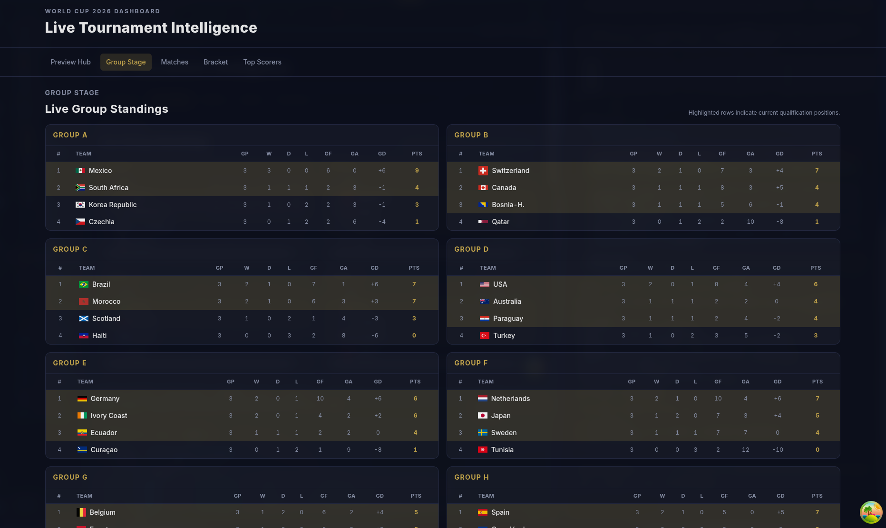
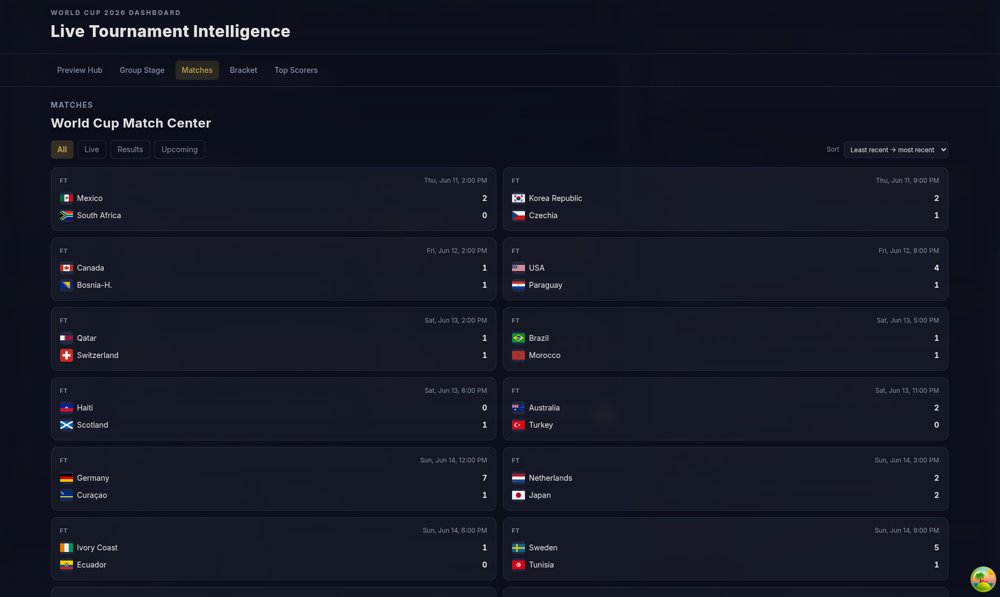
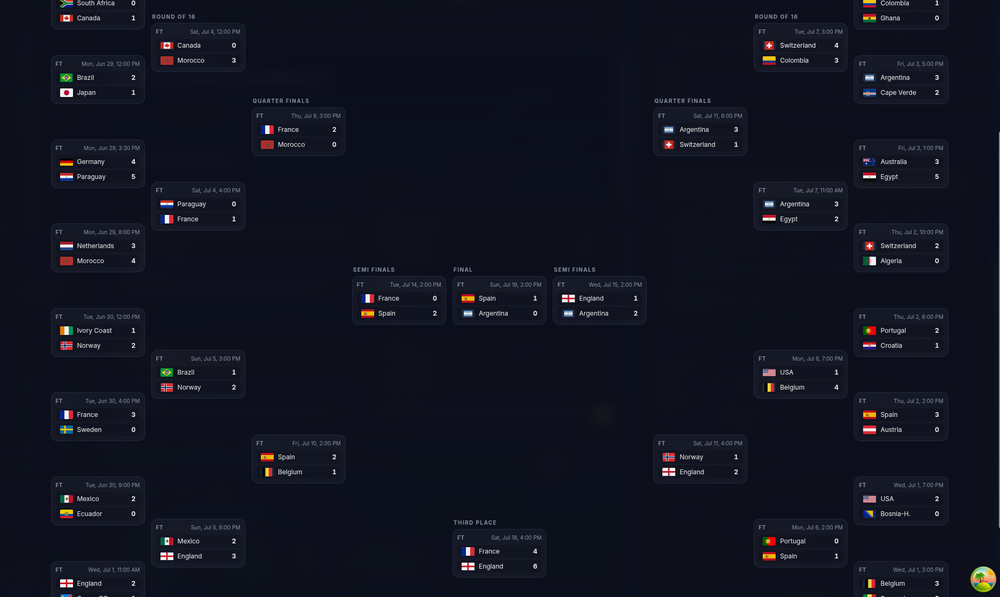
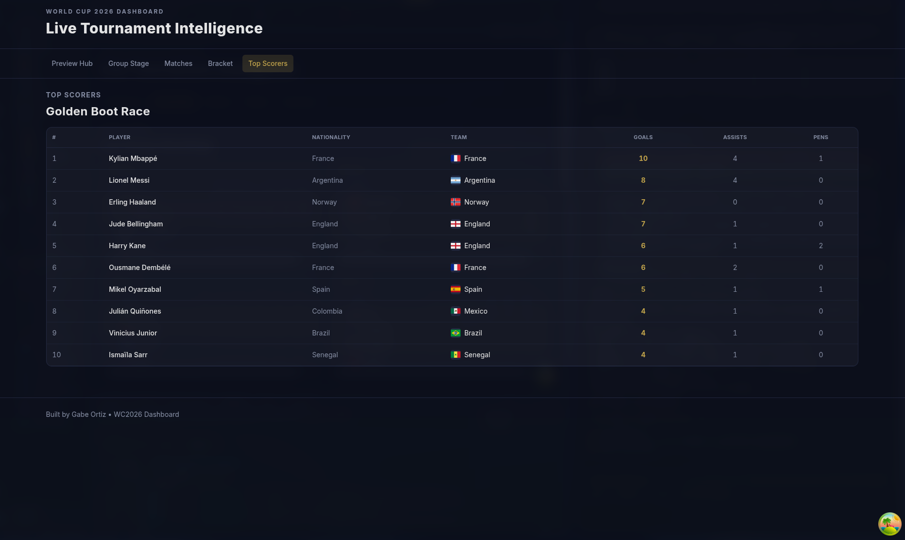

# World Cup 2026 Dashboard

A portfolio-focused React + TypeScript project that tracks 2026 World Cup data with a clean UI, typed API layer, and production-style engineering workflow.

[](https://www.typescriptlang.org/)
[](https://react.dev/)
[](https://vite.dev/)
[](../../actions)

## Overview

This dashboard highlights core front-end engineering skills:

- Typed API integration with `football-data.org`
- Server-state caching and refetching with TanStack Query
- Reusable component architecture and page-level routing
- Responsive layout patterns for data-heavy views
- Tests, linting, type-checking, and CI workflow

## Features

- Live group standings with qualification highlighting
- Match center with `All`, `Live`, `Results`, and `Upcoming` filters
- Match sort controls for kickoff ordering
- Knockout bracket layout by stage
- Top scorers table with crest fallback handling
- Loading skeletons and resilient error states

## Previews





## Tech Stack

- React 19 + TypeScript + Vite
- React Router
- TanStack Query
- Tailwind CSS
- Vitest + Testing Library
- ESLint + TypeScript strict checking
- GitHub Actions CI

## Getting Started

### 1) Clone and install

```bash
git clone https://github.com/1gabeortiz/world-cup-2026-dashboard.git
cd world-cup-2026-dashboard
npm install
cp .env.example .env.local
```

If you are on Windows, use one of these copy commands instead:

```powershell
# PowerShell
Copy-Item .env.example .env.local

# Command Prompt (CMD)
copy .env.example .env.local
```

Recommended runtime:

- Node.js `20+` (Node `22` LTS recommended)

### 2) Configure environment variables

Get your API key:

1. Create a free account at [football-data.org](https://www.football-data.org/client/register).
2. Verify your email and log in.
3. Open your dashboard/profile and copy your API token.
4. Paste it into `.env.local` as `VITE_FD_API_KEY`.

Edit `.env.local`:

```bash
VITE_FD_API_KEY=your_football_data_api_key
VITE_FD_BASE_URL=/api
```

### 3) Run locally

```bash
npm run dev
```

Open `http://localhost:5173`.

## Local Preview Workflow

Use this when you want a polished local walkthrough before taking screenshots:

```bash
# Dev preview (opens browser)
npm run dev:host

# Production-like preview from built files
npm run preview:local
```

Preview routes:

- `http://localhost:5173/preview`
- `http://localhost:4173/preview`

## Quality Checks

```bash
npm run lint
npm run typecheck
npm run test
npm run build
```

## Project Structure

```text
src/
  api/          # typed API client + response models
  components/   # reusable UI and feature components
  hooks/        # TanStack Query data hooks
  pages/        # route-level views
  utils/        # formatting and match-state helpers
```

## Roadmap

- Add final screenshot gallery + short walkthrough GIF
- Stabilize hosted preview after API proxy decision
- Expand tests for hooks and key route-level loading/error states

## Notes

- `.env.local` is intentionally not committed.
- API keys should only live in local env files or hosting platform secrets.
